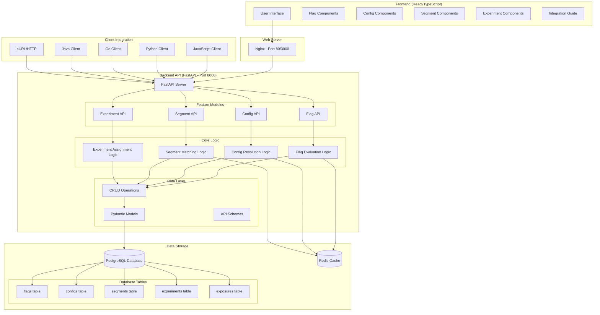
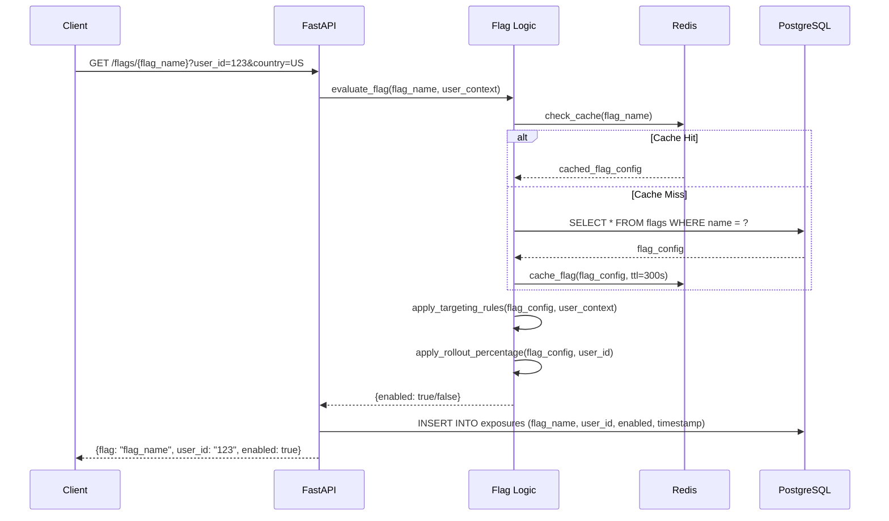
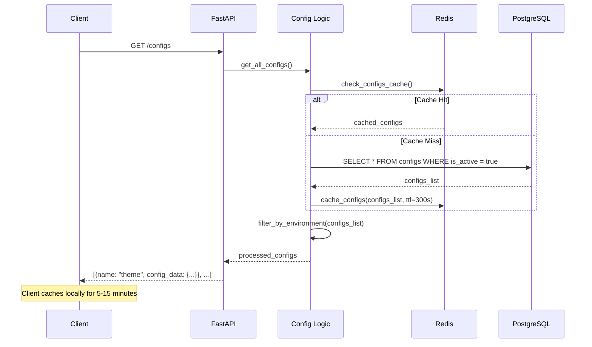
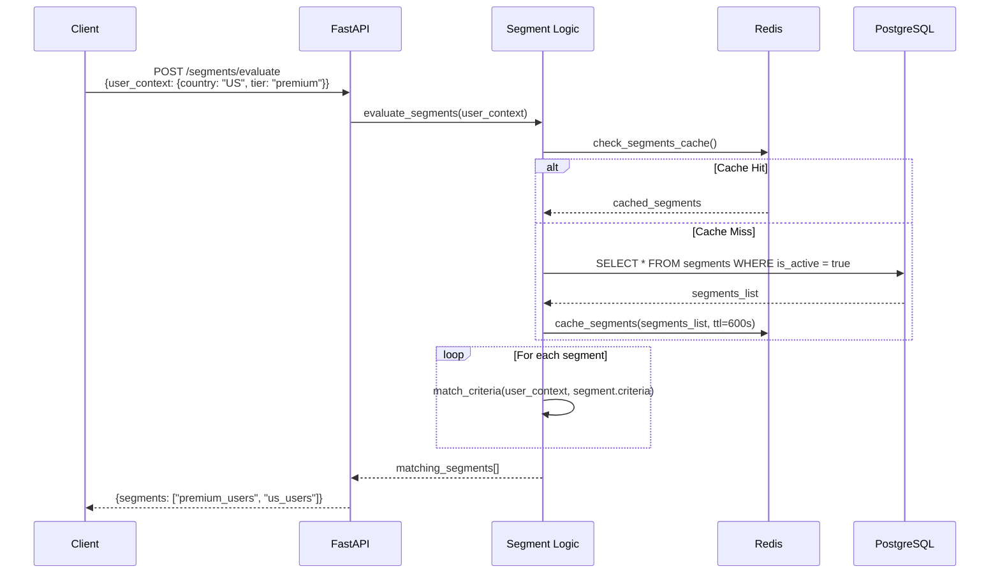
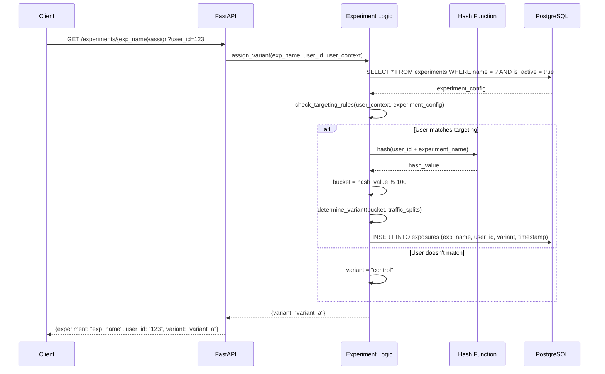
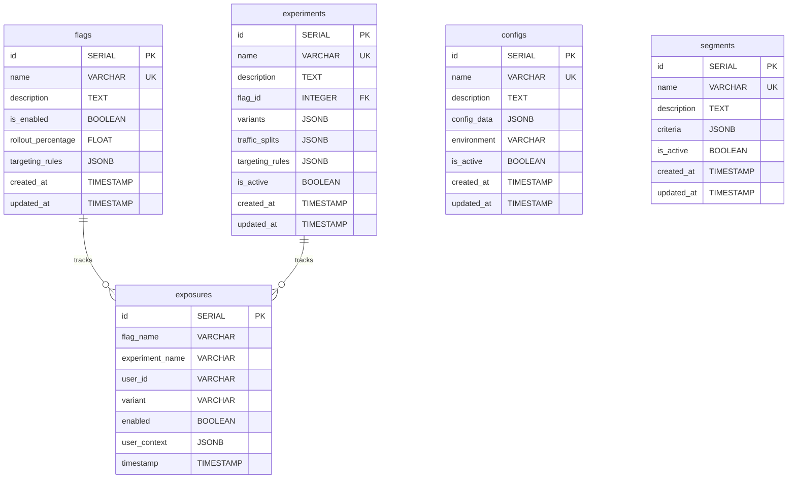
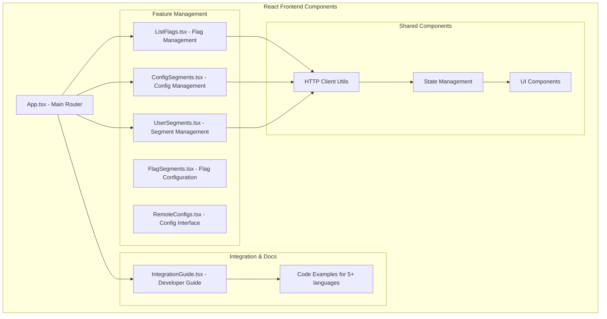
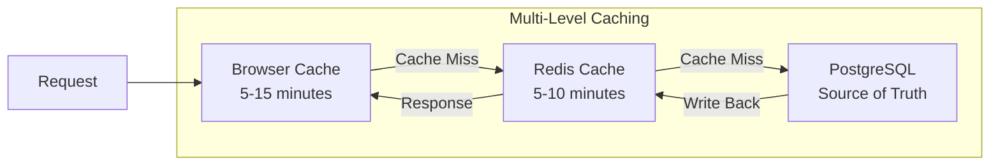
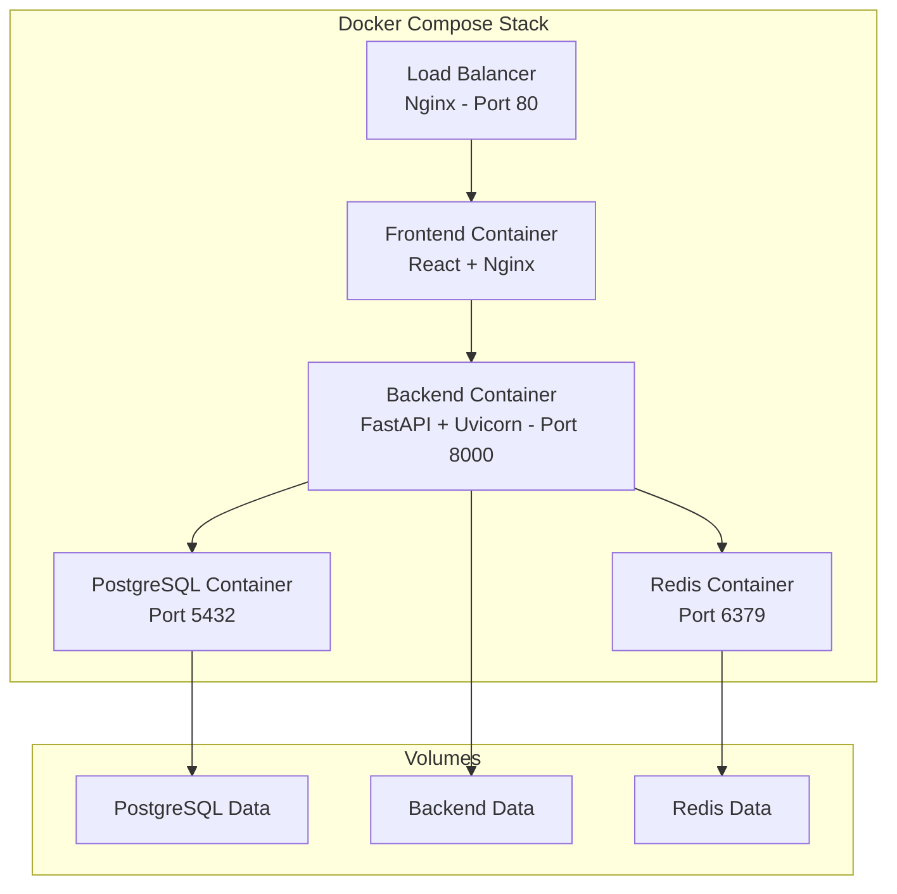

# OptiFork Architecture Diagram

## System Overview



## Feature Architecture Deep Dive

### 1. Feature Flags System



**Location**: `/backend/crud.py:check_flag()` and `/backend/main.py:/flags/{flag_name}`

### 2. Remote Configs System



**Location**: `/backend/crud.py:get_configs()` and `/backend/main.py:/configs`

### 3. User Segments System



**Location**: `/backend/crud.py:get_segments()` and `/backend/main.py:/segments`

### 4. A/B Testing Experiments



**Location**: `/backend/crud.py:assign_experiment()` and `/backend/main.py:/experiments/{experiment_name}/assign`

## API Endpoints Reference

### Feature Flags APIs
```
📍 File Location: /backend/main.py (lines 100-150)

GET    /flags                     # List all flags
POST   /flags                     # Create new flag
GET    /flags/{flag_name}         # Evaluate flag for user
PUT    /flags/{flag_name}         # Update flag
DELETE /flags/{flag_name}         # Delete flag
GET    /flags/{flag_name}/exposures # Get flag exposure data
```

### Remote Configs APIs
```
📍 File Location: /backend/main.py (lines 200-250)

GET    /configs                   # List all configs
POST   /configs                   # Create new config
GET    /configs/{config_id}       # Get specific config
PUT    /configs/{config_id}       # Update config
DELETE /configs/{config_id}       # Delete config
```

### User Segments APIs
```
📍 File Location: /backend/main.py (lines 300-350)

GET    /segments                  # List all segments
POST   /segments                  # Create new segment
GET    /segments/{segment_id}     # Get specific segment
PUT    /segments/{segment_id}     # Update segment
DELETE /segments/{segment_id}     # Delete segment
POST   /segments/evaluate         # Evaluate user against segments
```

### Experiments APIs
```
📍 File Location: /backend/main.py (lines 400-450)

GET    /experiments               # List all experiments
POST   /experiments               # Create new experiment
GET    /experiments/{exp_name}/assign # Assign user to variant
GET    /experiments/{exp_name}/results # Get experiment results
PUT    /experiments/{exp_name}    # Update experiment
```

## Database Schema



**Location**: `/backend/models.py` and `/backend/db.py`

## Frontend Component Architecture



**Locations**: 
- `/frontend/src/App.tsx` - Main application component
- `/frontend/src/components/` - All feature components
- `/frontend/src/components/IntegrationGuide.tsx` - Developer documentation

## Data Flow Examples

### 1. Creating a Feature Flag
```
User Input (Frontend) 
    ↓ POST /flags
FastAPI Validation (backend/schemas.py)
    ↓ 
Business Logic (backend/crud.py:create_flag())
    ↓
Database Insert (PostgreSQL flags table)
    ↓
Cache Invalidation (Redis)
    ↓ 
Response to Frontend
```

### 2. Evaluating a Flag for User
```
Client Request: GET /flags/new_feature?user_id=123&country=US
    ↓
API Route Handler (backend/main.py:check_flag())
    ↓
Cache Check (Redis: flag:new_feature)
    ↓ (if miss)
Database Query (PostgreSQL: SELECT * FROM flags...)
    ↓
Targeting Rules Evaluation (backend/crud.py:evaluate_targeting())
    ↓ 
Rollout Percentage Check (hash-based bucketing)
    ↓
Exposure Logging (PostgreSQL: INSERT INTO exposures...)
    ↓
Response: {enabled: true/false}
```

### 3. Segment-based Configuration
```
Client: GET /configs (with user context in headers)
    ↓
Segment Evaluation (determine which segments user belongs to)
    ↓
Config Resolution (check for segment-specific configs first)
    ↓ 
Fallback to General Config (if no segment-specific config exists)
    ↓
Response: Merged configuration object
```

## Caching Strategy



## Security & Performance

### Rate Limiting
```
📍 Location: /backend/main.py (middleware setup)

- API requests: 1000/hour per IP
- Flag evaluations: 10000/hour per user
- Config fetches: 100/hour per client
```

### Authentication (Future)
```
- API Key based authentication
- JWT tokens for user context
- Role-based permissions for admin features
```

### Performance Optimizations
```
1. Redis caching for frequently accessed data
2. Connection pooling for PostgreSQL
3. Async/await for non-blocking I/O
4. Database indexes on frequently queried fields
5. Client-side caching with TTL
```

## Deployment Architecture



**Location**: `/docker-compose.yml` - Complete orchestration setup

## Getting Started - Quick Reference

### 1. Start the System
```bash
docker-compose up -d
```

### 2. Access Points
- **Frontend**: http://localhost (port 80)
- **API Docs**: http://localhost:8000/docs  
- **API Base**: http://localhost:8000

### 3. Example API Calls
```bash
# Check a flag
curl "http://localhost:8000/flags/new_feature?user_id=123&country=US"

# Get configs
curl "http://localhost:8000/configs"

# Create a segment
curl -X POST "http://localhost:8000/segments" \
  -H "Content-Type: application/json" \
  -d '{"name": "premium_users", "criteria": {"tier": "premium"}}'
```

This architecture supports scalability, maintainability, and provides a clear separation of concerns between feature management, configuration, user segmentation, and experimentation.